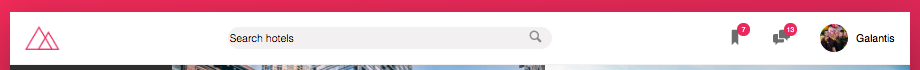
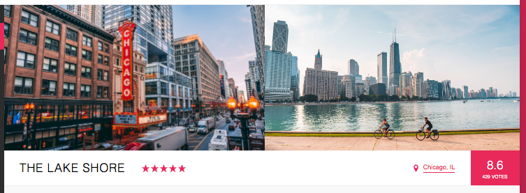
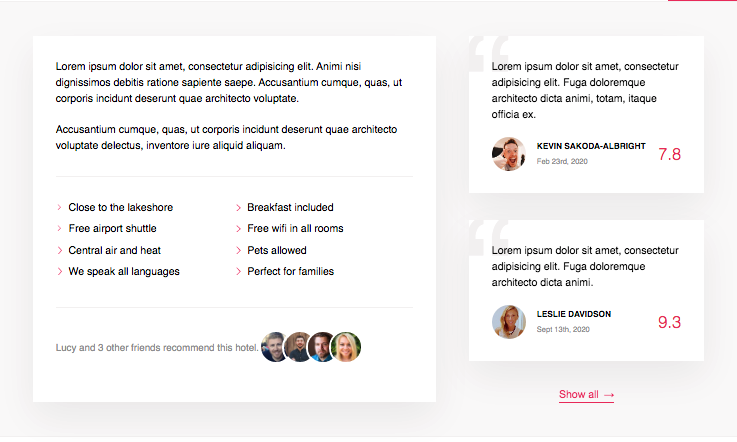

# Flex Booking App   

### Checkout the Live Version of the [Project](https://dcc5235.github.io/Flex_Reviews/)!

**HTML5, CSS3, SCSS**

A responsive, Flexbox-focused project for a sample hotel booking app. The site includes Flexbox designs, SVGs, and animated button features for the hotel overview page.

---

## Installation & Technologies

- Download the full package, select the Code button, choose the "Download ZIP" option.
- Requires Node.js to run: install [Node.js](https://nodejs.org/en/), current version.
  - <code>npm install</code> to install the Node Sass and libraries, specifically these packages will also be installed.
    - "autoprefixer"
    - "concat"
    - "node-sass"
    - "npm-run-all"
    - "postcss-cli"
  - <code>npm run start</code> to open local server.
- SASS/SCSS: install [Sass](https://sass-lang.com/install), current version.

---

## Project Highlights

Section | Features
------------ | -------------
[Header](#Header) | Flexbox alignment techniques (i.e. justify-content, align-items, align-self, flex) & SVG icons for better user accessibility.
[Navigation](#Navigation) | Flexbox horizontal and vertical alignment at different viewports, multiple transition properties with different settings to create animated hover effect.
[Main: Hotel Overview](#Main1) | Flexbox margin auto to target overall review rating, infinite animated button.
[Main: Description](#Main2) | Flexbox flexwrap feature to build multi-column list, CSS masks for browser support.
[Main: Call to Action](#Main3) | Flexbox alignment showcasing animated hover effect that changes text on hover.

## Header

## Navigation

## Main1

## Main2

## Main3

---

## Contributors

Dany Chheang dany.chheang@gmail.com 
Design by Jonas Schmedtmann
